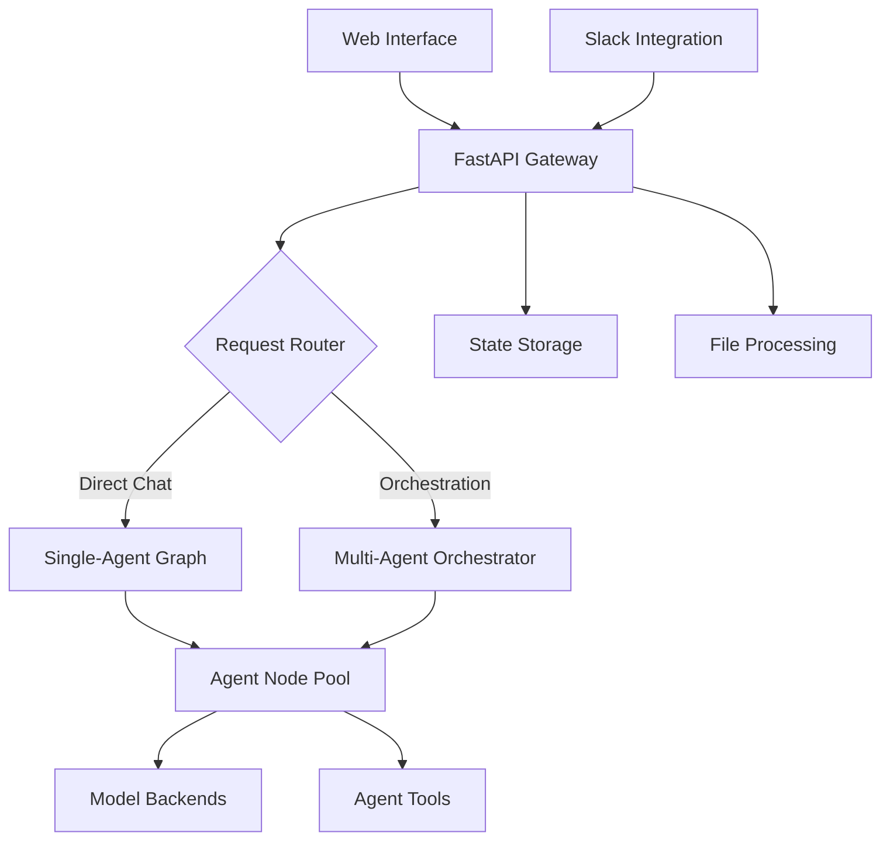

# AgentHive Design Document

## Overview

AgentHive is a unified multi-agent system built on LangGraph that provides dual operational modes: direct agent interaction and autonomous task orchestration. The system uses a single pool of specialized agent nodes that can be dynamically composed into either simple single-agent graphs or complex multi-agent orchestration workflows. The architecture supports multimodal input processing, multiple AI model backends, and deployment across various platforms.

## Architecture

### High-Level Architecture



### Core Components

1. **API Gateway Layer**: FastAPI-based routing and request handling
2. **Graph Execution Engine**: LangGraph-powered workflow management
3. **Agent Node Pool**: Centralized repository of specialized agents
4. **State Management**: Persistent conversation and task context
5. **Multimodal Processing**: File upload and content analysis pipeline
6. **Model Abstraction**: Unified interface for multiple AI providers

## Components and Interfaces

### 1. Agent State Schema

The shared state object that maintains context across all interactions:

```python
from typing import TypedDict, Annotated, List, Dict, Any
import operator
from langchain_core.messages import BaseMessage

class AgentState(TypedDict):
    task: str                                           # Primary task description
    messages: Annotated[List[BaseMessage], operator.add]  # Conversation history
    next: str                                           # Next agent to route to
    scratchpad: Dict[str, Any]                         # Agent working memory
    mode: str                                          # "direct" or "orchestration"
    active_agents: List[str]                           # Currently involved agents
    multimodal_content: Dict[str, Any]                 # Processed files and media
    session_id: str                                    # Unique session identifier
```

### 2. Agent Node Factory

Standardized agent creation with consistent interfaces:

```python
def create_agent_node(
    agent_name: str,
    system_prompt: str,
    tools: List[Any],
    model_config: Dict[str, Any],
    capabilities: List[str]
) -> callable:
    """
    Creates a standardized agent node function.
    
    Args:
        agent_name: Unique identifier for the agent
        system_prompt: Agent's specialized instructions
        tools: Available tools for the agent
        model_config: Model selection and parameters
        capabilities: List of agent capabilities (e.g., ["vision", "code_execution"])
    
    Returns:
        Callable agent node function compatible with LangGraph
    """
```

### 3. Graph Factory System

#### Single-Agent Graph Factory

```python
def create_direct_chat_graph(agent_node_name: str, agent_node_func: callable) -> CompiledGraph:
    """
    Creates a simple graph for direct agent interaction.
    
    Flow: START -> Agent Node -> END
    """
    workflow = StatefulGraph(AgentState)
    workflow.add_node(agent_node_name, agent_node_func)
    workflow.set_entry_point(agent_node_name)
    workflow.add_edge(agent_node_name, END)
    return workflow.compile()
```

#### Multi-Agent Orchestrator Graph

```python
def create_orchestrator_graph(agent_nodes: Dict[str, callable]) -> CompiledGraph:
    """
    Creates the complex orchestration graph with conditional routing.
    
    Flow: START -> Task Analyzer -> Router -> [Agent Nodes] -> Coordinator -> END
    """
    workflow = StatefulGraph(AgentState)
    
    # Add orchestration nodes
    workflow.add_node("task_analyzer", analyze_task_requirements)
    workflow.add_node("router", route_to_appropriate_agents)
    workflow.add_node("coordinator", coordinate_agent_responses)
    
    # Add all agent nodes
    for name, func in agent_nodes.items():
        workflow.add_node(name, func)
    
    # Define conditional routing logic
    workflow.add_conditional_edges("router", determine_next_agent, agent_nodes.keys())
    
    return workflow.compile()
```

### 4. API Gateway Interface

```python
class AgentHiveAPI:
    def __init__(self):
        self.agent_nodes = self._load_agent_configurations()
        self.direct_graphs = self._create_direct_graphs()
        self.orchestrator_graph = self._create_orchestrator_graph()
        self.file_processor = MultimodalProcessor()
        self.state_manager = StateManager()
        self.composio_client = ComposioMCPClient()
    
    async def direct_chat(self, agent_name: str, message: str, files: List[UploadFile] = None) -> StreamingResponse
    async def orchestrate_task(self, task: str, files: List[UploadFile] = None) -> StreamingResponse
    async def get_agent_status(self, session_id: str) -> Dict[str, Any]
    async def upload_multimodal_content(self, files: List[UploadFile]) -> Dict[str, Any]
    async def get_available_tools(self, agent_name: str = None) -> Dict[str, List[str]]
```

### 5. Composio MCP Integration

AgentHive integrates with Composio via Model Context Protocol (MCP) to provide extensive tool access across all agents:

```python
class ComposioMCPClient:
    def __init__(self, mcp_config: Dict[str, Any]):
        self.mcp_servers = self._initialize_mcp_servers(mcp_config)
        self.tool_registry = self._build_tool_registry()
    
    async def get_tools_for_agent(self, agent_name: str, capabilities: List[str]) -> List[MCPTool]:
        """Dynamically fetch relevant tools based on agent capabilities"""
        
    async def execute_tool(self, tool_name: str, parameters: Dict[str, Any]) -> Any:
        """Execute tool via appropriate MCP server"""
        
    def _build_tool_registry(self) -> Dict[str, List[str]]:
        """Map agent types to relevant Composio tool categories"""
        return {
            "full_stack_dev": ["github", "linear", "slack", "notion", "figma"],
            "qa_engineer": ["github", "linear", "slack", "browserbase", "serpapi"],
            "product_designer": ["figma", "notion", "slack", "miro", "airtable"],
            "devops_engineer": ["github", "aws", "docker", "kubernetes", "datadog"]
        }
```

### 6. Specialized Agent Definitions

#### Full Stack Engineer Agent
- **Capabilities**: Code generation, architecture design, debugging, code review
- **Core Tools**: Code execution, file system access, package management, git operations
- **Composio Tools**: GitHub (repo management, PR creation), Linear (issue tracking), Slack (team communication), Notion (documentation), Figma (design handoff)
- **Model Requirements**: Code-specialized models (GPT-4, Claude-3.5-Sonnet)

#### QA Engineer Agent
- **Capabilities**: Test planning, test case generation, bug analysis, quality assessment
- **Core Tools**: Test framework integration, coverage analysis, performance testing
- **Composio Tools**: GitHub (test automation), Linear (bug reporting), Browserbase (web testing), SerpAPI (competitive analysis), Slack (team updates)
- **Model Requirements**: Analytical models with strong reasoning capabilities

#### Product Designer Agent
- **Capabilities**: UI/UX design, wireframing, design system creation, accessibility review
- **Core Tools**: Design file processing, color analysis, layout generation
- **Composio Tools**: Figma (design creation/review), Notion (design docs), Miro (brainstorming), Airtable (design system management), Slack (design feedback)
- **Model Requirements**: Vision-capable models for design analysis

#### DevOps/Systems Engineer Agent
- **Capabilities**: Infrastructure design, deployment automation, monitoring setup, security analysis
- **Core Tools**: Container management, configuration management
- **Composio Tools**: AWS (cloud infrastructure), GitHub (CI/CD), Docker (containerization), Kubernetes (orchestration), Datadog (monitoring)
- **Model Requirements**: Models with strong technical reasoning and security awareness

## Data Models

### 1. Agent Configuration Model

```python
@dataclass
class AgentConfig:
    name: str
    display_name: str
    description: str
    system_prompt: str
    model_provider: str  # "openai", "anthropic", "google"
    model_name: str
    capabilities: List[str]  # ["vision", "code_execution", "web_search"]
    core_tools: List[str]  # Built-in system tools
    composio_tools: List[str]  # Composio/MCP tool categories
    max_tokens: int
    temperature: float
    specialized_for: List[str]  # Domain expertise areas
    mcp_server_configs: Dict[str, Any]  # MCP server configurations
```

### 2. Session Management Model

```python
@dataclass
class Session:
    session_id: str
    user_id: str
    mode: str  # "direct" or "orchestration"
    active_agent: Optional[str]
    created_at: datetime
    last_activity: datetime
    state: AgentState
    multimodal_files: List[ProcessedFile]
```

### 3. Multimodal Content Model

```python
@dataclass
class ProcessedFile:
    file_id: str
    original_name: str
    file_type: str  # "image", "pdf", "document"
    processed_content: Dict[str, Any]  # Extracted text, image analysis, etc.
    metadata: Dict[str, Any]
    processing_timestamp: datetime
```

## Error Handling

### 1. Agent-Level Error Handling

```python
class AgentError(Exception):
    def __init__(self, agent_name: str, error_type: str, message: str):
        self.agent_name = agent_name
        self.error_type = error_type
        self.message = message
        super().__init__(f"{agent_name}: {error_type} - {message}")

class ErrorRecoveryStrategy:
    @staticmethod
    def handle_model_timeout(state: AgentState) -> AgentState:
        """Retry with fallback model or route to different agent"""
        
    @staticmethod
    def handle_tool_failure(state: AgentState, tool_name: str) -> AgentState:
        """Attempt alternative tools or graceful degradation"""
        
    @staticmethod
    def handle_routing_failure(state: AgentState) -> AgentState:
        """Default to human handoff or general assistant"""
```

### 2. System-Level Error Handling

- **Model Unavailability**: Automatic fallback to alternative models
- **Rate Limiting**: Queue management and request throttling
- **State Corruption**: State validation and recovery mechanisms
- **File Processing Failures**: Graceful degradation with error reporting

## Testing Strategy

### 1. Unit Testing

- **Agent Node Testing**: Individual agent behavior validation
- **Graph Execution Testing**: Workflow routing and state management
- **API Endpoint Testing**: Request/response validation
- **Multimodal Processing Testing**: File upload and content extraction

### 2. Integration Testing

- **End-to-End Workflows**: Complete user journeys through both modes
- **Multi-Agent Collaboration**: Orchestration workflow validation
- **External Service Integration**: Model provider and tool integration
- **State Persistence Testing**: Session management and recovery

### 3. Performance Testing

- **Concurrent User Handling**: Load testing for multiple simultaneous sessions
- **Large File Processing**: Multimodal content handling at scale
- **Model Response Times**: Latency measurement across different providers
- **Memory Usage**: State management efficiency under load

### 4. User Acceptance Testing

- **Mode Switching**: Seamless transition between direct and orchestration modes
- **Agent Specialization**: Validation of domain-specific expertise
- **Multimodal Interactions**: File upload and processing user experience
- **Interface Responsiveness**: Web and Slack integration usability

## Deployment Architecture

### 1. Containerized Deployment

```dockerfile
# Multi-stage build for optimized production image
FROM python:3.11-slim as base
# Application dependencies and code
FROM base as production
# Production configuration and health checks
```

### 2. Environment Configuration

```yaml
# docker-compose.yml
services:
  agent-hive-api:
    build: .
    environment:
      - OPENAI_API_KEY=${OPENAI_API_KEY}
      - ANTHROPIC_API_KEY=${ANTHROPIC_API_KEY}
      - GOOGLE_API_KEY=${GOOGLE_API_KEY}
      - COMPOSIO_API_KEY=${COMPOSIO_API_KEY}
      - REDIS_URL=${REDIS_URL}
      - DATABASE_URL=${DATABASE_URL}
      # MCP Server configurations
      - MCP_GITHUB_TOKEN=${GITHUB_TOKEN}
      - MCP_LINEAR_API_KEY=${LINEAR_API_KEY}
      - MCP_FIGMA_TOKEN=${FIGMA_TOKEN}
      - MCP_AWS_ACCESS_KEY=${AWS_ACCESS_KEY}
      - MCP_AWS_SECRET_KEY=${AWS_SECRET_KEY}
    ports:
      - "8000:8000"
    volumes:
      - ./mcp-config:/app/mcp-config
  
  redis:
    image: redis:7-alpine
    
  postgres:
    image: postgres:15-alpine
```

### 3. Scaling Strategy

- **Horizontal Scaling**: Multiple API instances behind load balancer
- **Agent Pool Scaling**: Dynamic agent node allocation based on demand
- **State Management**: Redis cluster for distributed session storage
- **File Storage**: S3-compatible storage for multimodal content

### 4. Monitoring and Observability

- **Health Checks**: Agent availability and model connectivity
- **Metrics Collection**: Response times, error rates, usage patterns
- **Logging**: Structured logging with correlation IDs
- **Alerting**: Automated notifications for system issues